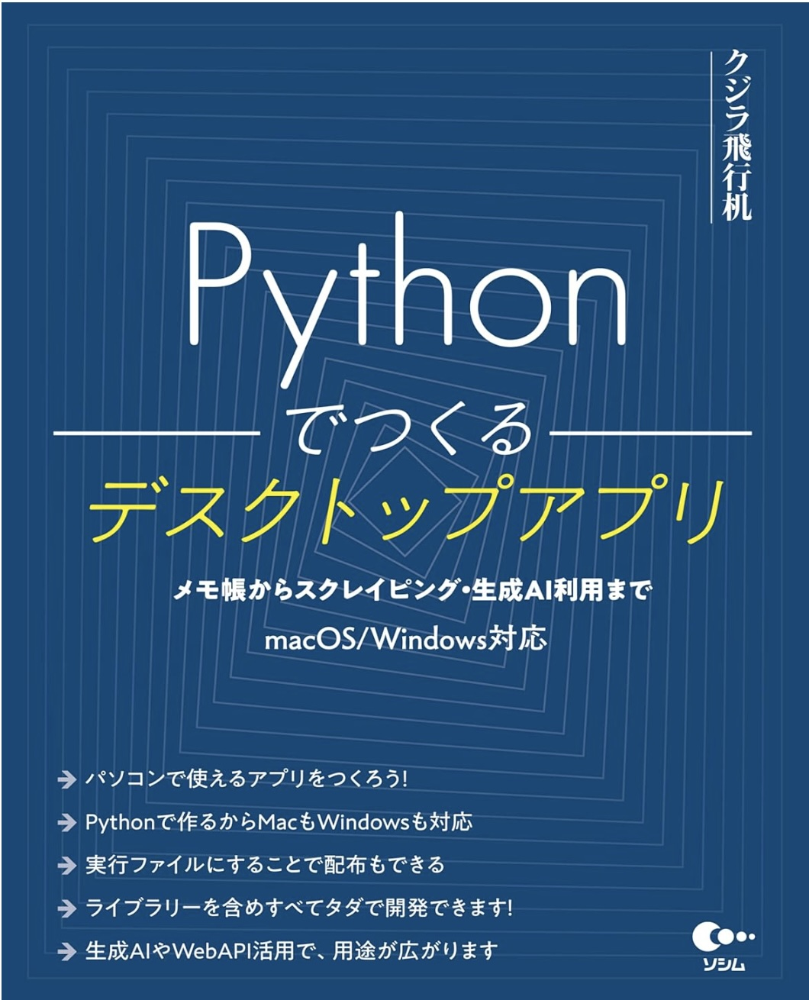

# (書籍) Pythonで作るデスクトップアプリ

書籍のサンプルを以下よりZIP形式でダウンロードできます。

- [サンプルをダウンロード](https://github.com/kujirahand/book-desktop-python-sample/releases)
- [書籍の修正部分](/README.md#%E6%9B%B8%E7%B1%8D%E3%81%AE%E4%BF%AE%E6%AD%A3%E9%83%A8%E5%88%86)

## 書籍の情報

- タイトル: Pythonでつくるデスクトップアプリ - メモ帳からスクレイピング・生成AI利用まで
- ISBN-10: 480261473X
- ISBN-13: 978-4802614733
- 出版社: ソシム (2024/7/20)
- 単行本: 450ページ
- [🔗Amazon](https://amzn.to/4cis2jo)

## 書籍の修正部分

以下、書籍出版後に変更があった部分と誤植に関する情報です。

### TKEasyGUIのインストールコマンドについて

**P.056** において、オプション「-U」の記述に誤りがありました。このパラメーターは、指定のバージョンに強制的に変更する、バージョン指定がなければ最新版にアップデートという意味なのですが、-Uの位置がinstallの後にあるのが正しいです。

- [誤] `python -m pip -U install TkEasyGUI`
- [正] `python -m pip install -U TkEasyGUI`

なお、特に「-U」オプションがなくても動作します。

- [正] `python -m pip install TkEasyGUI`

- [参考:TkEasyGUIのインストール方法](https://github.com/kujirahand/tkeasygui-python/blob/main/README-ja.md#%E3%82%A4%E3%83%B3%E3%82%B9%E3%83%88%E3%83%BC%E3%83%AB)

### PySimpleGUIの仕様変更に関して

　PySimpleGUIですが、以前から懸念されていたものの、いよいよ本格的に有料化されました。これに伴い、過去のOSSライセンス時代のPySimpleGUIは完全に削除されました。通常、PyPIで履歴を見ると、過去のいろいろなバージョンが表示されるのですが、最新の5.0.8.2以外を全部削除してしまったようです。この機会に互換ライブラリの[TkEasyGUI](https://pypi.org/project/TkEasyGUI/)をご利用ください。

- 【参考】https://pypi.org/project/PySimpleGUI/#history

**P.055** に『上記のコマンドを実行すると、PySimpleGUIのオープンソース（LGPL）で公開された最後のバージョンである、4.60.5をインストールします』とありますが、バージョン4系はインストールできなくなりました。そのため、下記のように読み替えてください。

- [誤] python -m pip install -U PySimpleGUI==4.60.5
- [正] python -m pip install PySimpleGUI

**P.061** は、下記のように、読み替えてください。

- [修正前] PySimpleGUIののインストール方法は、前節で紹介した通り、コマンドを1行実行するだけでインストールが完了します。しかし、PySimpleGUIの最新版を利用したいという場合もあるでしょう。それ以上、更新されない古いライブラリーを使い続けるのには不安もあります。そこで、ここでは、PySimpleGUIの最新版（バージョン5以降）を使う方法を紹介します。
- [修正後] PySimpleGUIのインストール方法は、前節で紹介した通り、コマンドを1行実行するだけです。ただし、使い続けるには、ライセンスの登録などの作業が必要になります。ここでは、改めて、PySimpleGUIをインストールとライセンス登録の手順を紹介します。

